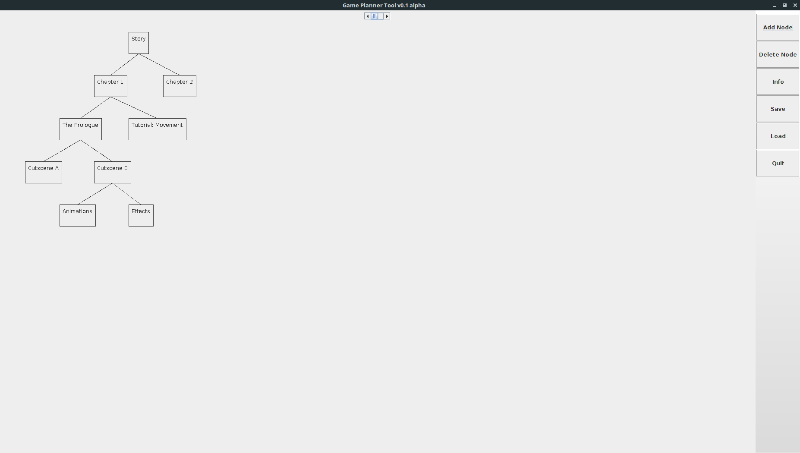
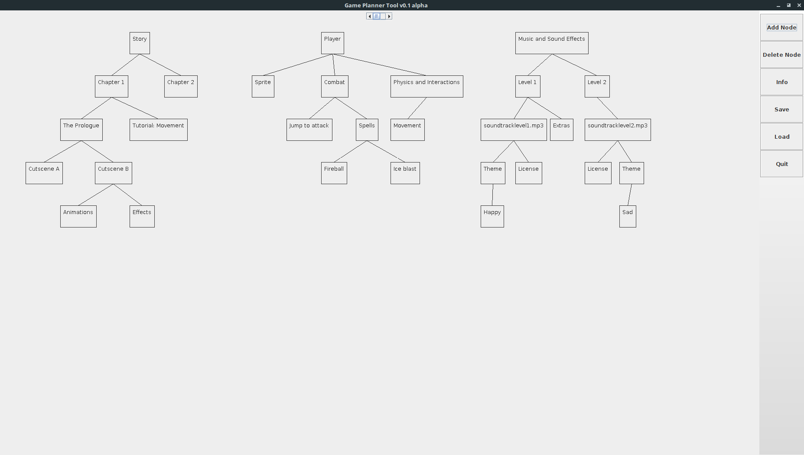

# GamePlannerTool
This is an application that is designed to plan out core concepts of a video game that I created bit by bit over the course of two days. It is simple, easy to use, and does not require that many resources.

Initially, I wanted to create a software program that would help me map out ideas for my very own game that I am working on at the moment, but I ended up coming to the conclusion that I should stick with other existing solutions out there, such as Trello or HacknPlan. I went after a node/tree system because I like the concept of it and I think that it is efficient. I have abandoned this mini project for now, but it was fun brushing up my skills with the Java Swing library.

# Bugs
This application is very inconsistent, mainly because most values for hardcoded (e.g. spacing between nodes). Had I spent more time on this project, all values would've been passed into equations which would've achieved consistency.

# Screenshots

